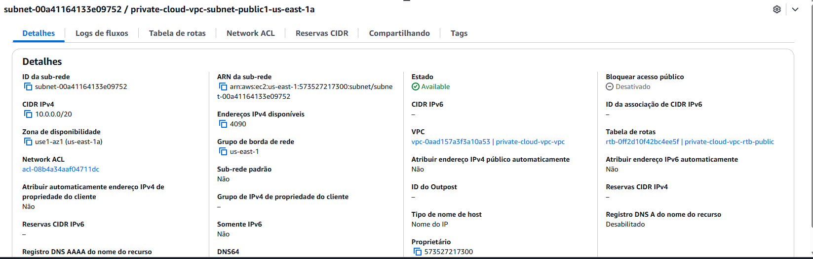
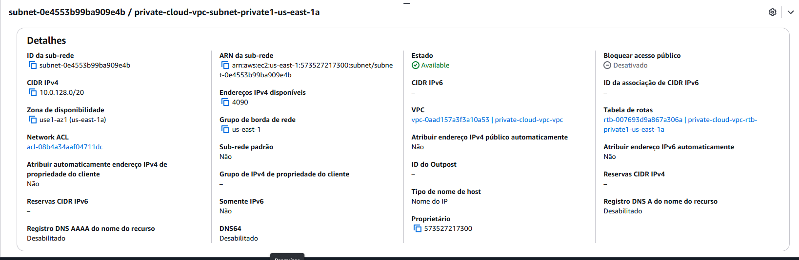
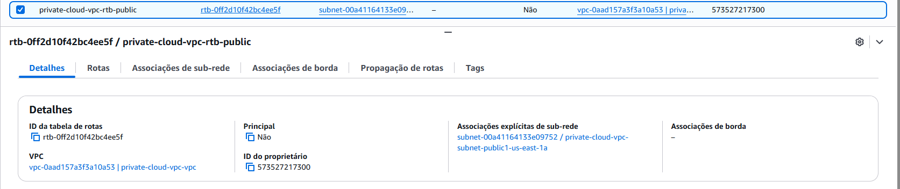

# ☁️ Projeto Private Cloud – AWS
## 📄 Descrição

Este projeto simula uma **arquitetura de nuvem privada corporativa (Private Cloud)** utilizando a AWS, com foco em isolamento de rede, segurança, controle de acesso e boas práticas de infraestrutura em nuvem.

O laboratório representa um ambiente real utilizado por empresas que operam com **infraestrutura privada em cloud**, onde servidores críticos não possuem acesso público direto à internet.

---

## 🎯 Objetivo do Projeto

Construir uma infraestrutura privada em nuvem aplicando conceitos reais de:

- Arquitetura de redes em cloud  
- Isolamento de ambientes  
- Segurança de acesso  
- Segmentação de rede  
- Controle de tráfego  
- Boas práticas corporativas  

---

## 🧱 Arquitetura da Solução

A estrutura do projeto é composta por:

- VPC dedicada (rede privada)  
- Subnet pública  
- Subnet privada  
- Internet Gateway  
- NAT Gateway  
- Bastion Host (EC2 pública)  
- EC2 privada (sem IP público)  
- Grupos de segurança segmentados  
- Acesso SSH encadeado (Bastion → EC2 privada)  

---
## 🌐 VPC (Rede Privada)

Criação de uma VPC dedicada para isolamento completo da infraestrutura.

---

## 📡 Subnets

### Subnet Pública
Responsável por recursos com acesso à internet (Bastion Host, NAT Gateway).

### Subnet Privada
Responsável por servidores internos sem acesso direto à internet.

---

## 🌍 Internet Gateway

Permite que recursos da subnet pública tenham acesso à internet.

## 🗺️ Tabelas de Rotas

### Route Table Pública
Direcionamento de tráfego para o Internet Gateway.

### Route Table Privada
Direcionamento de tráfego para o NAT Gateway.

---
## 🔐 Grupos de Segurança (Security Groups)

### Bastion Host
Permite acesso SSH externo controlado.

### EC2 Privada
Permite acesso somente via Bastion Host.

---

## 💻 Instâncias EC2

### Bastion Host (EC2 Pública)
Servidor intermediário de acesso seguro à rede privada.

### EC2 Privada
Servidor interno sem IP público, isolado da internet.

---
## 🔑 Acesso Seguro (SSH)

### Acesso ao Bastion Host
Conexão inicial via SSH.
Acesso da Bastion → EC2 Privada
Acesso interno via rede privada.
:

---
## 📚 Competências Desenvolvidas

- Arquitetura de Private Cloud  
- Redes em cloud  
- Segurança em nuvem  
- Segmentação de infraestrutura  
- Infraestrutura corporativa  
- Cloud Support  
- Cloud Infrastructure  
- Cloud Operations  
- IaaS (Infrastructure as a Service)  

---

